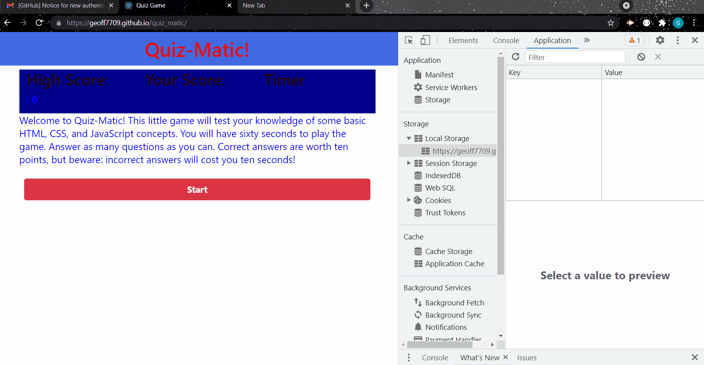

# QUIZmatic!!!

 ## Table of contents
  ---
  [Description](#description)

  [Usage](#usage)

  [Contributing](#contributing)

  [Questions](#questions)

  [License](#license)

## Description

Coding quiz application using local storage and vanilla JavaScript to test the user's knowledge of basic HTML, CSS, and JavaScript concepts. Used to explore local storage use and HTML manipulation.
## Usage

Navigate to the [deployed website](https://geoff7709.github.io/quiz_matic/) and follow the prompts in the app:

## Technologies

This application utilizes:
* HTML, CSS and Javascript
* Local Storage

## Contributing
  Please note that this project is released with a Contributor Code of Conduct. By participating in this project you agree to abide by its terms.
  
  ## Questions
  [GitHub Repository](https://github.com/Geoff7709/quiz_matic)

  For further questions please feel free to email the developers:

  geoffzimmerman23@gmail.com
  ## License
  Use of this software is regulated under the following lisence:

  [MIT](https://opensource.org/licenses/MIT)
